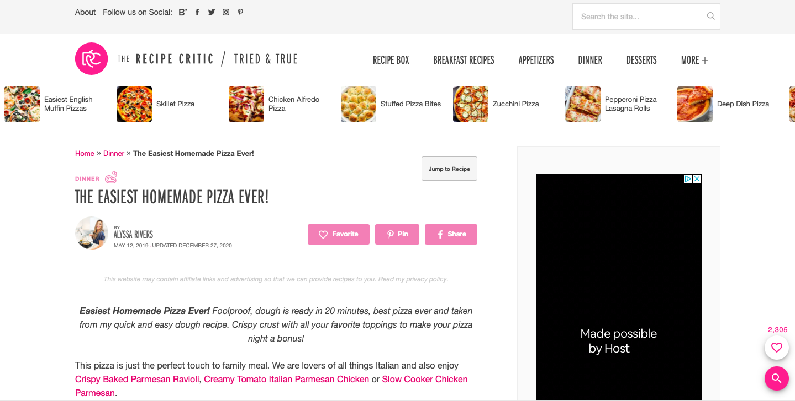

# Improving Standard of Living for Senior Citizens
## DH110 Assignment 1 : Heuristic Evaluation - Mingzhe Li (Vera)

ajergvaeurgfiuer description about the project and how to contribute to ur ux project

### Part I : National Council on Aging
https://www.ncoa.org/older-adults

The National Council on Aging website provides help for senior citizens in various aspects. They have done a good job by including detailed information about aging as well as categorizing the roles of people surrounding the topic of aging. By dividing the website into four main categories: older adults, caregivers, professionals and advocates, each person can be directed to the section that suits them the most when they open this website. However, there are some flaws about this website, including missing error messages, vague drop down menus and inappropriate sizes of images. These issues will be discussed in detail using 10 Heuristics below. 

| Heuristics | Severity Rating | Evaluation | Improvement |
| ---------- | ------ | ---------- | ----------- |
| **#1: Visibility of system status**: The design should always keep users informed about what is going on, through appropriate feedback within a reasonable amount of time. | 1 | **Good**: When people click on the "Older Adults" tab on the top, they can be directed to the relative page and big fonts of "Older Adults" are shown at the top, indicating that this section is for old people. **Bad**: However, if people scroll down the website, the tab "Older Adults" on the top is not displaced differently than other tabs such as "Caregivers", "Professionals" and "Advocate". People might get lost at which tab they are on since there is so much information on this website. | The tabs should be highlighted with different colors when the viewer is viewing respective tabs. This will provide viewers clearer information about which page they are on. |
| **#2: Match between system and the real world**: The design should speak the users' language. Use words, phrases, and concepts familiar to the user, rather than internal jargon. Follow real-world conventions, making information appear in a natural and logical order. | 1 | **Good**: Overall, the website has a great match between the real world and the system. It does not use complicated language to convey simple meanings. The language is very accessible to older adults. **Bad**: There is one search bar that is a little bit off. Instead of simply saying "search", there is a tab called "Go to Tool" under "BenifitsCheckUp", which could make the website appear a bit complicated for some seniors. It is unusual to use "Go to Tool" in people's daily lives when they are trying to search for something. | Replace "Go to Tool" with easier directory words such as " Search". This will make the website connect more to the real world.  |
| **#3: User control and freedom**: Users often perform actions by mistake. They need a clearly marked "emergency exit" to leave the unwanted action without having to go through an extended process. | 2 | **Bad**: There is no back option for users to go back to the page that they were on after they open a new tab. They have to go to the menu bar and select the page again if they want to go back. | Implement a "Back" option to direct users to the previous page once they have opened a new page. |
| **#4: Consistency and standards**: Users should not have to wonder whether different words, situations, or actions mean the same thing. Follow platform and industry conventions. | 2 | **Bad**: The links to NCOA's various social media platforms are not consistent. Under the "share" option on the right side of the website, there are several icons linking to different social media platforms consisting of Facebook, Twitter, LinkedIn, Pinterest and their email. However, at the bottom of the page, under "Find us on Social", there are icons consisting of Facebook, Twitter, LinkedIn and YouTube. The inconsistency might lead to inconvinience of navigation for some users. | Make the icons under "share" and "Find us on Social" consistent so that users can easily navigate to the platform that they desire. |
| **#5: Error prevention**: Good error messages are important, but the best designs carefully prevent problems from occurring in the first place. Either eliminate error-prone conditions, or check for them and present users with a confirmation option before they commit to the action. | 3 | **Bad**: When users try to enter their email to sign up at the bottom of the page, they will not receive an error message if they have entered an invalid email address. Even if they enter a bunch of random characters, the website will still direct them to the "You are all signed up!" page. This may cause people to accidentally entering the wrong email address and still expect to receive an email. | Show an error page when the email address that the users enter does not seem to be a logical one.  |
| **#6: Recognition rather than recall**: Minimize the user's memory load by making elements, actions, and options visible. The user should not have to remember information from one part of the interface to another. Information required to use the design (e.g. field labels or menu items) should be visible or easily retrievable when needed. | 2 | **Good**: When users scroll down the website, the menu bar will still be on the top of the page so that users can navigate easily. **Bad**: Users cannot locate where they are at and they might have to remember which menu bar they are at to prevent going to the same page after reading that page. | Highlight users' current location on the website so that the users do not need to remember which page they are at. |
| **#7: Flexibility and efficiency of use**: Shortcuts — hidden from novice users — may speed up the interaction for the expert user such that the design can cater to both inexperienced and experienced users. Allow users to tailor frequent actions. | 1 | **Good**: The drop-down menu is easily identified. Each menu tab has several distinct sub-tabs. **Bad**: The sub-tabs can be classified into more subdivisions to make it even easier for users to navigate to the page that they want. | Include subdivisions for sub-tabs to make the information more locatable. |
| **#8: Aesthetic and minimalist design**: Interfaces should not contain information which is irrelevant or rarely needed. Every extra unit of information in an interface competes with the relevant units of information and diminishes their relative visibility. | 1 |**Good**: The website only contains relevant information. **Bad**: The pictures are too large. Users would have to scroll down a lot to view a little information. | Making the pictures smaller and the fonts bigger would be more ideal for users to navigate the information on the website. |
| **#9: Help users recognize, diagnose, and recover from errors**: Error messages should be expressed in plain language (no error codes), precisely indicate the problem, and constructively suggest a solution.  | 3 | The website is insufficient at identifying the error. When the users try to enter their email address, no error message will be displayed even though the email address is invalid. | It would be helpful to include an appropriate error messenge when users enter an invalid email account.|
| **#10: Help and documentation**: It’s best if the system doesn’t need any additional explanation. However, it may be necessary to provide documentation to help users understand how to complete their tasks. | 2 | **Good**: It has a contact us page where users can submit their questions. **Bad**: It does not have a FAQ page or a help page. Users cannot find answers on the website if they run into problems. | Include an FAQ page or a link to a help center on the website. |

### Part II: How to Make Pizza
https://therecipecritic.com/homemade-pizza/

DESCRPTIPJBWEGFIUGALFEIRQFUA

| Heuristics | Severity Rating | Evidence |Evaluation | Improvement |
| ---------- | ------ | -------- |---------- | ----------- |
| **#1: Visibility of system status**: The design should always keep users informed about what is going on, through appropriate feedback within a reasonable amount of time. | 3 | **Bad**: Since this is a webiste to teach people how to make pizza, users would want to see a recipe when they open this website. However, the website is at the bottom of the page. Users have to scroll down a lot to find the recipe. There is a "jump to recipe" botton but it is almost too small for anyone to notice. | Adjust the order of the website. Put the recipe before other questions. |
| **#2: Match between system and the real world**: The design should speak the users' language. Use words, phrases, and concepts familiar to the user, rather than internal jargon. Follow real-world conventions, making information appear in a natural and logical order. | 1 | **Good**: The website uses simple language that people would use in their daily life. There are no complicated words or phrases. **Bad**: The short form of some words may be comfusing to some people, especially non-native speakers. For exmaple, some people may not know what "tbsp" ot "tsp" mean. | Use formal words instead of short forms. |
| **#3: User control and freedom**: Users often perform actions by mistake. They need a clearly marked "emergency exit" to leave the unwanted action without having to go through an extended process. | 2 | **Bad**: There is no clear back option. Once the users click "Crispy Baked Parmesan Ravioli, Creamy Tomato Italian Parmesan Chicken or Slow Cooker Chicken Parmesan.", they cannot be directed back to the pizza page. | Include a back option on new pages that users open so that they can go back to the previous page if they want.  |
| **#4: Consistency and standards**: Users should not have to wonder whether different words, situations, or actions mean the same thing. Follow platform and industry conventions. | 1 | **Bad**: The menu bar is at the right side of the website. The design of the overall website is that useful information is on the left of the website and advertisements are on the right side of the website. Making the menu bar on the right side of the website may lead users to ignore the menu bar. | Put the three-dashes menu icon on the left side of the website instead of the right side. |
| **#5: Error prevention**: Good error messages are important, but the best designs carefully prevent problems from occurring in the first place. Either eliminate error-prone conditions, or check for them and present users with a confirmation option before they commit to the action. | 1 | **Good**: When users enter an invalid email address under "Get free recipes to your inbox", they will receive an error message. **Bad**: However, the error message is shown in red with black background. This color choice may make it hard for some users to read. | Choose another color for the erro message, such as white. |Improvement |
| **#6: Recognition rather than recall**: Minimize the user's memory load by making elements, actions, and options visible. The user should not have to remember information from one part of the interface to another. Information required to use the design (e.g. field labels or menu items) should be visible or easily retrievable when needed. | Rating | Evidence |Evaluation | Improvement |
| **#7: Flexibility and efficiency of use**: Shortcuts — hidden from novice users — may speed up the interaction for the expert user such that the design can cater to both inexperienced and experienced users. Allow users to tailor frequent actions. | 1 |  | Improvement |
| **#8: Aesthetic and minimalist design**: Interfaces should not contain information which is irrelevant or rarely needed. Every extra unit of information in an interface competes with the relevant units of information and diminishes their relative visibility. | 1 |**Good**:  | e. |
| **#9: Help users recognize, diagnose, and recover from errors**: Error messages should be expressed in plain language (no error codes), precisely indicate the problem, and constructively suggest a solution.  | Rating | Evidence |Evaluation | Improvement |
| **#10: Help and documentation**: It’s best if the system doesn’t need any additional explanation. However, it may be necessary to provide documentation to help users understand how to complete their tasks. | 2 | **Good**: It has a contact us page where users can submit their questions. **Bad**: It does not have a FAQ page or a help page. Users cannot find answers on the website if they run into problems. | Include an FAQ page or a link to a help center on the website. |

###### Citation: 10 Usability Heuristics for User Interface Design, https://www.nngroup.com/articles/ten-usability-heuristics/ 
