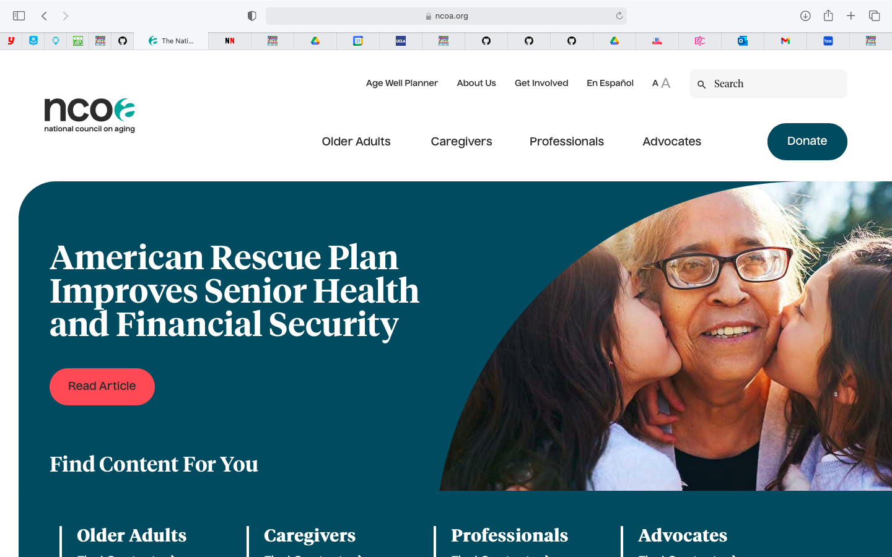

# Improving Standard of Living for Senior Citizens
## DH110 Assignment 1 : Heuristic Evaluation - Mingzhe Li (Vera)

https://www.ncoa.org/older-adults

| Heuristics | Rating | Evaluation | Improvement |
| ---------- | ------ | ---------- | ----------- |
| **#1: Visibility of system status**: The design should always keep users informed about what is going on, through appropriate feedback within a reasonable amount of time. | 1 | **Good**: When people click on the "Older Adults" tab on the top, they can be directed to the relative page and big fonts of "Older Adults" is shown at the top, indicating that this section is for old people. **Bad**: However, if people scroll down the website, the tab "Older Adults" on the top is not displaced differently than other tabs such as "Caregivers", "Professionals" and "Advocate". People might get lost at which tab they are on since there in so much information on this website. | The tabs should be highlighted with different color when the viewer is viewing respective tabs. This will provide viewers clearer information about which page they are on. |
| **#2: Match between system and the real world**: The design should speak the users' language. Use words, phrases, and concepts familiar to the user, rather than internal jargon. Follow real-world conventions, making information appear in a natural and logical order. | 1 | **Good**: Overall, the website has great match between real world and the system. It does not use complicated language to convey simple meanings. The language is very accessible to older adults. **Bad**: There is one search bar that is a little bit off. Instead of simply saying "search", there is a tab called "Go to Tool" under "BenifitsCheckUp", which could make the website appear a bit complicated for some senior. It is unusual to use "Go to Tool" in people's daily lives when they are trying to search something. | Replace "Go to Tool" with easier directory words such as " Search". This will make the website connect more to the real world.  |
| **#3: User control and freedom**: Users often perform actions by mistake. They need a clearly marked "emergency exit" to leave the unwanted action without having to go through an extended process. | 2 | **Bad**: There is no back option for users to go back to the page that they were on after they open a new tab. They have to go to the menu bar and select the page again if they want to go back. | Implement a "Back" option to direct users to the previous page once they have opened a new page. |
| **#4: Consistency and standards**: Users should not have to wonder whether different words, situations, or actions mean the same thing. Follow platform and industry conventions. | 2 | **Bad**: The links to NCOA's various social media platforms are not consistent. Under the "share" option on the right side of the website, there are several icons linking to different social media platforms consisting of Facebook, Twitter, LinkedIn, Pinterest and their email. However, at the bottom of the page, under "Find us on Social", there are icons consisting of Facebook, Twitter, LinkedIn and YouTube. The inconsistency might lead to inconvinience of navigation for some users. | Make the icons under "share" and "Find us on Social" consistent so that users can easily navigate to the platform that they desire. |
| **#5: Error prevention**: Good error messages are important, but the best designs carefully prevent problems from occurring in the first place. Either eliminate error-prone conditions, or check for them and present users with a confirmation option before they commit to the action. | Rating | Evidence |Evaluation | Improvement |
| **#6: Recognition rather than recall**: Minimize the user's memory load by making elements, actions, and options visible. The user should not have to remember information from one part of the interface to another. Information required to use the design (e.g. field labels or menu items) should be visible or easily retrievable when needed. | Rating | Evidence |Evaluation | Improvement |
| **#7: Flexibility and efficiency of use**: Shortcuts — hidden from novice users — may speed up the interaction for the expert user such that the design can cater to both inexperienced and experienced users. Allow users to tailor frequent actions. | Rating | Evidence |Evaluation | Improvement |
| **#8: Aesthetic and minimalist design**: Interfaces should not contain information which is irrelevant or rarely needed. Every extra unit of information in an interface competes with the relevant units of information and diminishes their relative visibility. | Rating | Evidence |Evaluation | Improvement |
| **#9: Help users recognize, diagnose, and recover from errors**: Error messages should be expressed in plain language (no error codes), precisely indicate the problem, and constructively suggest a solution.  | Rating | Evidence |Evaluation | Improvement |
| **#10: Help and documentation**: It’s best if the system doesn’t need any additional explanation. However, it may be necessary to provide documentation to help users understand how to complete their tasks. | Rating | Evidence |Evaluation | Improvement |

https://therecipecritic.com/homemade-pizza/

| Heuristics | Rating | Evidence |Evaluation | Improvement |
| ---------- | ------ | -------- |---------- | ----------- |
| **#1: Visibility of system status**: The design should always keep users informed about what is going on, through appropriate feedback within a reasonable amount of time. | Rating | Evidence |Evaluation | Improvement |
| **#2: Match between system and the real world**: The design should speak the users' language. Use words, phrases, and concepts familiar to the user, rather than internal jargon. Follow real-world conventions, making information appear in a natural and logical order. | Rating | Evidence |Evaluation | Improvement |
| **#3: User control and freedom**: Users often perform actions by mistake. They need a clearly marked "emergency exit" to leave the unwanted action without having to go through an extended process. | Rating | Evidence |Evaluation | Improvement |
| **#4: Consistency and standards**: Users should not have to wonder whether different words, situations, or actions mean the same thing. Follow platform and industry conventions. | Rating | Evidence |Evaluation | Improvement |
| **#5: Error prevention**: Good error messages are important, but the best designs carefully prevent problems from occurring in the first place. Either eliminate error-prone conditions, or check for them and present users with a confirmation option before they commit to the action. | Rating | Evidence |Evaluation | Improvement |
| **#6: Recognition rather than recall**: Minimize the user's memory load by making elements, actions, and options visible. The user should not have to remember information from one part of the interface to another. Information required to use the design (e.g. field labels or menu items) should be visible or easily retrievable when needed. | Rating | Evidence |Evaluation | Improvement |
| **#7: Flexibility and efficiency of use**: Shortcuts — hidden from novice users — may speed up the interaction for the expert user such that the design can cater to both inexperienced and experienced users. Allow users to tailor frequent actions. | Rating | Evidence |Evaluation | Improvement |
| **#8: Aesthetic and minimalist design**: Interfaces should not contain information which is irrelevant or rarely needed. Every extra unit of information in an interface competes with the relevant units of information and diminishes their relative visibility. | Rating | Evidence |Evaluation | Improvement |
| **#9: Help users recognize, diagnose, and recover from errors**: Error messages should be expressed in plain language (no error codes), precisely indicate the problem, and constructively suggest a solution.  | Rating | Evidence |Evaluation | Improvement |
| **#10: Help and documentation**: It’s best if the system doesn’t need any additional explanation. However, it may be necessary to provide documentation to help users understand how to complete their tasks. | Rating | Evidence |Evaluation | Improvement |

###### Citation: 10 Usability Heuristics for User Interface Design, https://www.nngroup.com/articles/ten-usability-heuristics/ 
