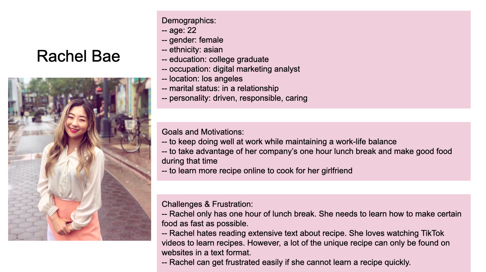
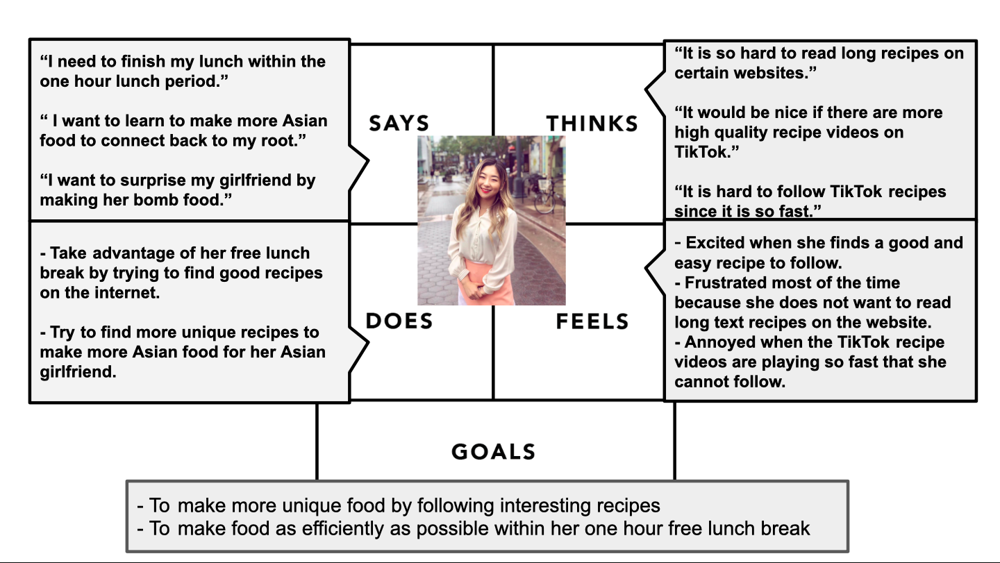
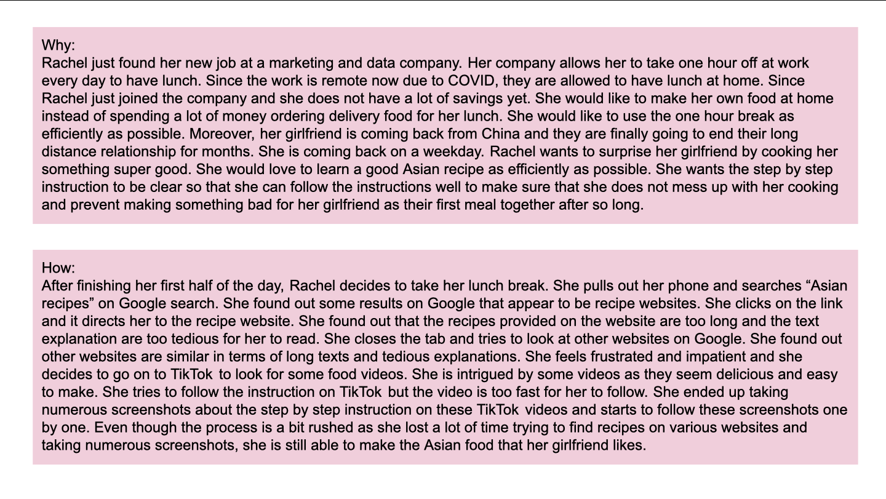
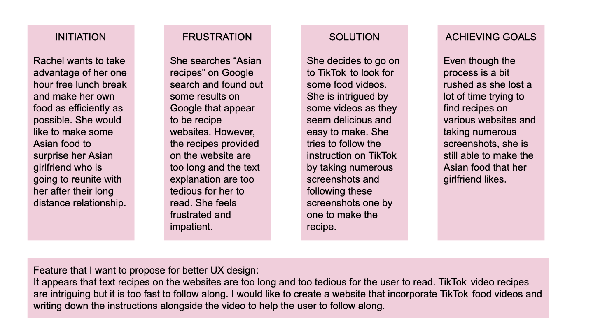

# The purpose of UX storytelling

The purpose of UX storytelling is to understand the users and connect with the users. It allows people to gain insights into the users’ thoughts, behaviors, actions, and contexts. By creating persona that represents potential users, the design team can know better about the uses' needs and provide better product for the users. 

# Key features I want to propose for the UX design

1. Short video tutorial alongside with written text recipes
2. Audio function of the recipe websites

# PART I

# PART II

