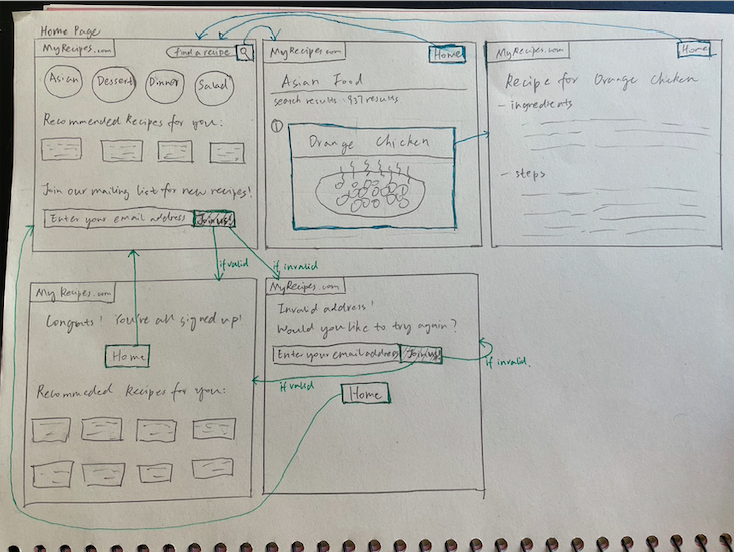

# DH110 Assignment 6: Low Fidelity Prototype

## Mingzhe Li (Vera)

### Project description

### Wireframes & Wireflow

First sequence: Searching up certain recipe (in blue)

Second sequence: Signing up for email list (in green)

### Prototype testing

### Reflection

