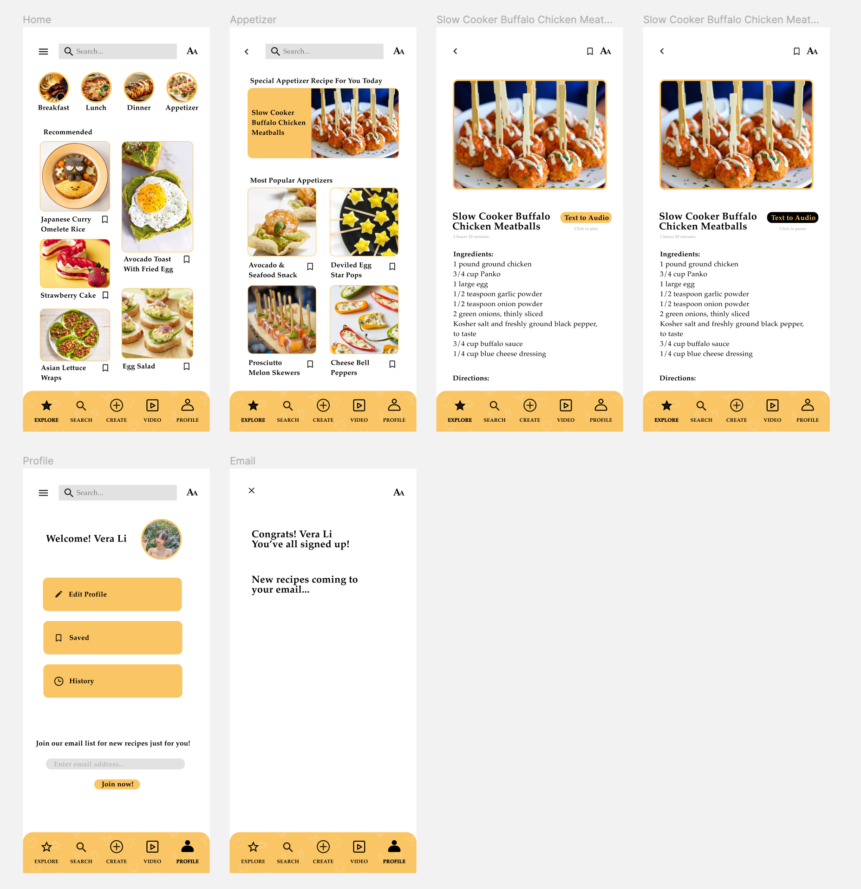
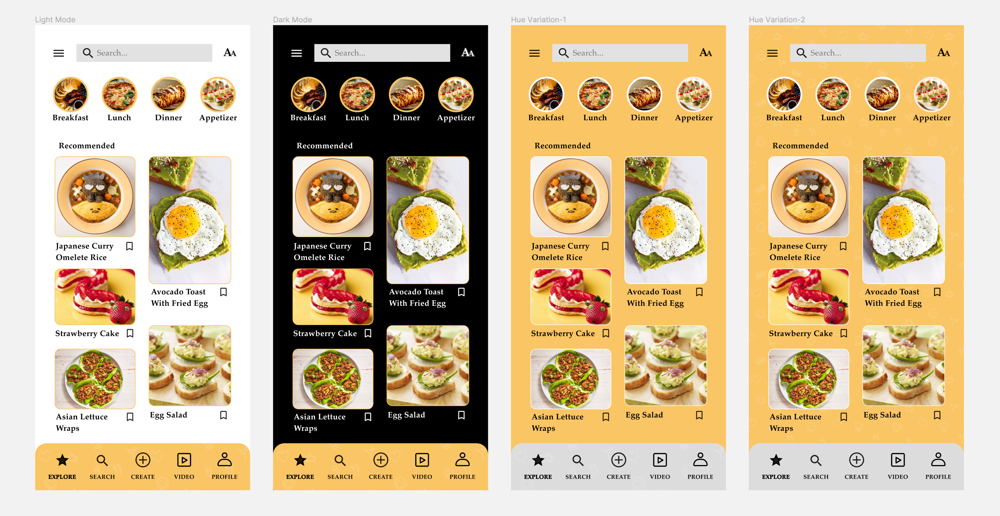
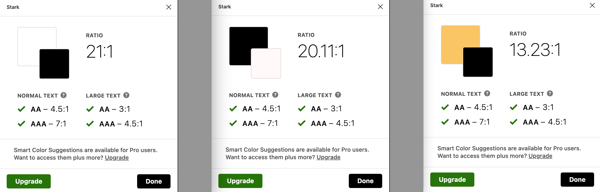
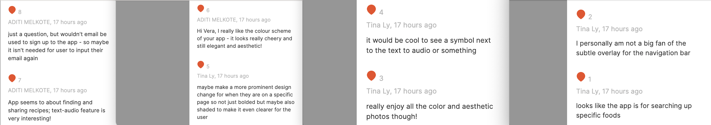
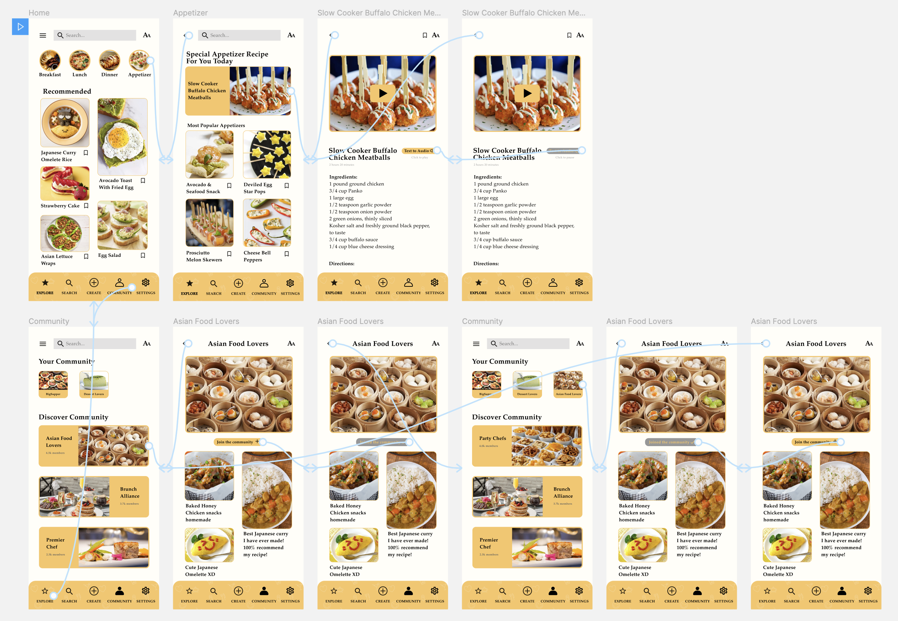

# User Interface Design and Interactive Prototype

## Mingzhe Li (Vera)

### Description of project 

This is a high-fidelity prototype of a recipe application. The prototype is created by Figma. The purpose of the testing is to examine the functions of two features designed based on the persona, Rachel Bae and Charlie Stewart. This high-fidelity prototype is transformed from the low-fidelity hand-drawn prototype with improved graphic elements, UI material components, and features.

The process takes place in terms of two full sequences of activities users can perform on the application. First, when user wants to browse the recipes and check out certain recipes that they are interested in, they can click the categories icon on the top of the home page. For example, the user clicks the appetizer icon and it will direct the user to the appetizers section. If the user is interested in the special recipe, they will click on the icon and it will direct them to the detailed recipe page. If the user prefers to listen to the recipe instead of reading the text, like our persona Charlie  Stewart, they can simply click the "text to audio" icon to hear the recipe instead of reading it. Secondly, when the user goes to their profile, they can join the email list and receive new recipes. This will be helpful for people like our persona Rachel Bae who always wants to explore new recipes and stay up to date. (Revised: Instead of joining the email list to stay up-to-date, users can join communities that they are interested in to get new recipes.) 

### Screen design

My screen design is shown below. 

As shown below, I have created design variations with different color schemes including light-mode, dark-mode and hue variations. For the two hue variations, I put the subtle pattern on the main background for one design and the subtle pattern on the menu bar at the bottom for another design. 

### Accessibility (color-contrast) check

As shown in the picture below, my design passes the color check for all color variations. 

### Design System

For typography, I used Palatino, which is is the name of an old-style serif typeface. I mainly used size 14 and Bold to keep the font consistent. I used some variations of the fonts throughout my app design. While keeping the font as Palatino for all the pages, I made some title size 20 to highlight the information and make the design more dynamic. I also used regular instead of bold for some detailed information such as recipe steps and ingredients to differentiate the level of information presented on the page. 

For the color scheme, I was trying to go for a general warm tone so I choose the light orange color (HEX: FAC564) as my main color. I used the light orange color mainly for my menu bar, buttons and as highlight strokes for my images. I kept the background as the white color to maintain a clean and neat interface design. I used black color for my texts to make them readable from the white and yellow background. 

For spacing, I made the icons equidistance from each other as well as from the center. I made the design symmetrical to keep the interface neat and accessible. 

For other graphical interface designs, I made the icon and the text on the menu bar bold to show that the location of the user on my app. I also create an icon on the top right corner of every page to make sure that the user can adjust the font size on the app anytime. I also created the save button next to every recipe to make it convenient for users to save the recipe whenever they want. Last but not least, I created a "Text to Audio" icon next to every recipe to provide the option to hear the recipe instead of reading the recipe. They can also click the button again to stop the audio at any time. 

### Impression test

#### Summary of findings

In summary, my design seems to be clear to the user in terms of the seems as the users can pin point correctly what my design is about. They also seem to enjoy the color and the aesthetic. In addition, they seem to be interested in the "text to audio" design since both of them made comments about it. However, I would change some of my design to make sure they have better user experience. The revisions are listed below. 

#### Revision based on the findings

One of my users pointed out that the email sign up page is a bit confusing since people might have already registered with their email when they sign up. Thus, instead of changing the email sign up page, i am thinking of replacing it with a "community" function. People can still get updates about new recipes by going into the community that they join instead of getting an email. Furthermore, one of my user pointed out that it might be better to put an icon next to the "text to audio" button to make it more aesthetic. I think that is a really good suggestion and I am going to incorporate that in my new design. Moreover, she also suggested that she personally does not really like the subtle overlay of the navigation bar. I am thinking of keeping the design for now and do more usability testing in the future to decide whether I will keep the subtle pattern or not. I am also going to change some of the font size to distinguish the information on my website more. 

### Revised Interactive Prototype and Wireflow

My interactive prototype can be found [here](https://www.figma.com/file/2Uao2hjoxDc5WHN16NNJl2/DH110?node-id=10%3A5822).

Task 1: Browse the explore page and read certain recipe. Option to read the recipes outload by clinkcing the "text to audio" button and stopping it at anytime.

Taks 2: Join certain communities to get more information about recipes of certain categories.

### Reflection

#### Summary 

Overall, my design process went pretty smoothly. I was able to use Figma well and was able to research the solutions when I encountered any technical difficulties. I also changed up a lot of my design based on people's feedback. In addition to changing my design according to the suggestions that my users gave me from the impression test, I also changed my background color from white to very light yellow to avoid causing uncomfort for the users when they read black texts on white background. 

#### What I would do differently

I designed a lot of the icons by myself by drawing and that took a lot of time. I found out that there are a lot of simple icons that I can copy and paste. Next time when I design my website, I think I will use these icons instead of drawing since they are pretty similar to my drawing. I will devote my time to draw the icons only when I want to create a very unique icon in the future. 
