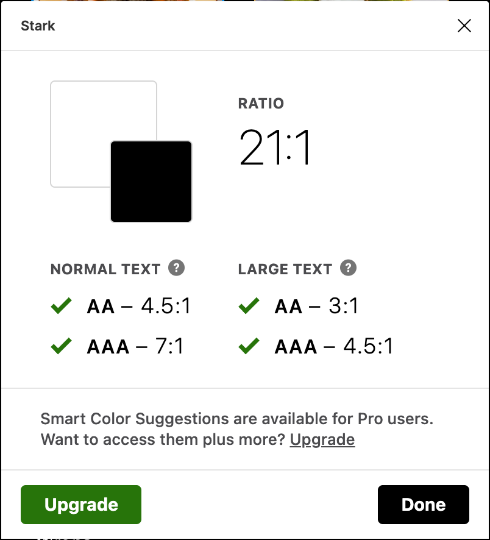
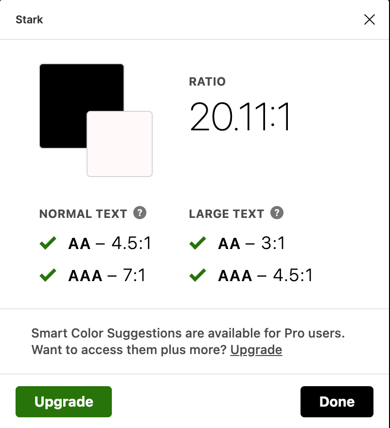
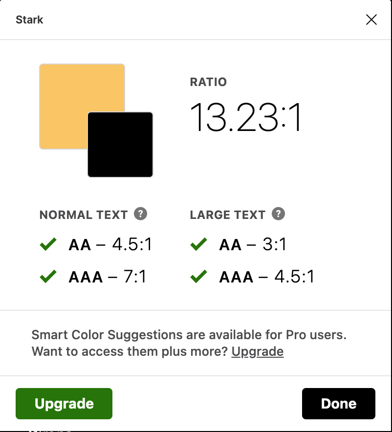

# Interactive Prototype

## Mingzhe Li (Vera)

### Description of project 

+1: Brief summary of the project, the process and the purpose of this high-fidelity prototype; the tasks the prototype demonstrates.

### Screen design
+1:  At least three distinctive screen templates that represent user-interface design with standard graphical components (ex. Material ui component)
+1: Select one screen template (ex. login-page). Provide at least three design variations with different color schemes (ex. light-mode, dark-mode, hue variation)

### Accessibility (color-contrast) check
+1: Provide the evidence of checking the color contrast for the accessibility WCAG2.0 AA level. (ex. Spark plugin test screenshot)

  

### Design System
1: provide a summary of graphic design including
Typeface family + size
Color scheme: background, primary (default text), focus (ex. button)
Layout grid + spacing
+1: Thoughtful description about how you made the decisions for the graphical interface design 
