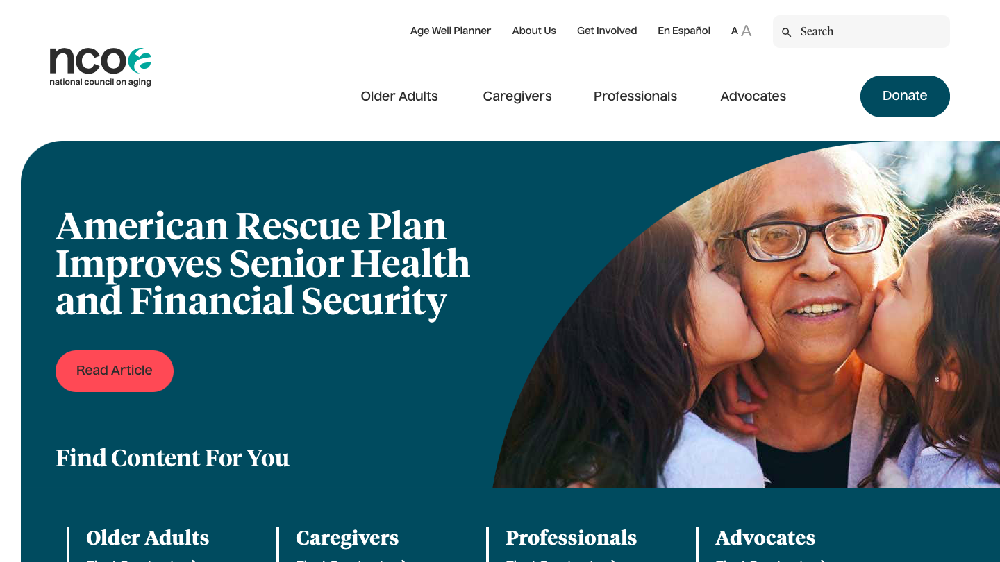

# Michelin at home: Make cooking fun and engaging for all 

## Vera Li

### Introduction

This project is about designing an application that makes it easier for people to cook at home. This application includes video tutorials, audio tutorials and recipe communities for all people to join. Due to COVID-19, the need for home-cooking increased tremendously. It is important to provide more accessible recipe websites for people to cook at home, including senior citizens. With the increasing use of technology among young people, an increasing number of applications have been designed to cater to them. The need for the elderly to use online applications is often overlooked. Thus, I would like to design an application that is not only popular among young people, but can also cater to the needs of senior citizens as well. This application is especially elderly-friendly. With features such as “text to audio” and easily adjustable font size on the app, the elderly can navigate to their favorite recipe and learn to cook easily. 

### Design statement

Through my UX design project, I hope to impact the lives of senior citizens and others by offering an easy and seamless way to find recipes online that they would like to try and help them stay up-to-date to their favorite kinds of food by offering them to join various recipe communities to stay connected. 

### Competitor analysis

To get a sense of how other websites and applications were presenting information on food and recipe, I conducted heuristic evaluations on two websites: The National Council on Aging and the Recipe Critic website. I chose to analyze these two sites because they represented two important features about the application that I intend to design -- senior citizens and recipes. By evaluating them against the 10 heuristic, I am more informed about how these websites choose to present information to account for user experience. [Read more...](https://github.com/limingzhe421/DH110/tree/main/assignment01)

### User research

I conducted usability testing about the Recipe Critic website to determine the extent to which an interface facilitates a user’s ability to complete routine tasks. The purpose of the usability testing aims to find out how to improve the website from the user's perspective. I learned that usability issues do exist for this website. For example, my participant thought that there was too much inconsistency in this website and she described the website as busy. This shows that the website does not reflect the aesthetic and minimalist design. It also took my participant longer than expected to find the recipe and print it out, showing there is a lack of visibility of system status. I learned to bear these issues in mind when designing my application to provide a better user experience for the users. [Read more...](https://github.com/limingzhe421/DH110/tree/main/assignment02)

### UX storytelling

One central way to develop empathy for our users is to take their perspective. We can do this by creating personas, scenarios, user journeys, and empathy maps. These transport us out of our own lives and into the lives of our users. Throughout the design process, we can think back to our users' context through these materials. Based on my understanding of my target users, I developed two personas and scenarios that depicted the typical interactions with the app. One persona represents the young audience and the other persona represents the senior citizens.  [Read more...](https://github.com/limingzhe421/DH110/tree/main/assignment04)

### Low-fidelity prototype

The purpose of creating and testing this low-fidelity prototype is to test whether the features that I want to include on the website are helpful for the users.According to my user research, the user personas that I have identified are people who are responsible for cooking their own meals and people who are responsible for cooking for others. They have the desire to cook but have limited knowledge of certain recipes. They are willing to try new recipes online.
The features I included for people to use are searching up new recipes, signing up for the email list on recipe websites and listening to recipe instructions online. People can search up recipes by typing in the food category or certain names of the dish and clicking the search bar. They can also sign up for the email list by entering their email and clicking "Join us!". Last but not least, they can also listen to the instructions for certain recipes if they do not want to reach the webpage and stop the reading if they want.  [Read more...](https://github.com/limingzhe421/DH110/tree/main/assignment05)

### High-fidelity prototype 

This is a high-fidelity prototype of a recipe application. The prototype is created by Figma. The purpose of the testing is to examine the functions of two features designed based on the persona, Rachel Bae and Charlie Stewart. This high-fidelity prototype is transformed from the low-fidelity hand-drawn prototype with improved graphic elements, UI material components, and features. I have created design variations with different color schemes including light-mode, dark-mode and hue variations. For the two hue variations, I put the subtle pattern on the main background for one design and the subtle pattern on the menu bar at the bottom for another design. My design also passes the color check for all color variations. [Read more...](https://github.com/limingzhe421/DH110/blob/main/assignment06/README.md)

### Evaluation and revision history 
After cognitive walkthrough, impression test, accessibility audit, I made some revision to my design [here](https://github.com/limingzhe421/DH110/blob/main/assignment06/README.md).

After the revision, I conducted 5 more usability testing since most of the usability issues can be found with 5 usability testings. The videos of the usability testing can be found below.

[Participant1](https://youtu.be/_ji6FpmC6JI)

[Participant2](https://youtu.be/fyVDOKtzd5c)

[Participant3](https://youtu.be/sUopmlJToZ0)

[Participant4](https://youtu.be/Q_sIKgzExxM)

[Participant5](https://youtu.be/65WlydE30us)

Findings from these usability testings:

All of the users were able to successfully complete the two tasks. They generally find the application very easy to use and they do not need further help to use the application. They find the app very trustworthy and they find themselves very likely to perform the tasks as suggested. The top three works chosen from the production satisfaction card by the users are “trustworthy”, “calm” and “fresh”. They also suggested some potential improvement for the app such as making certain icons bigger to make it more user friendly. 

### Pitch video 

My pitch video can be found [here]

### Conclusion

Overall, my UX design process went pretty smoothly and I have learned a lot throughout the process. I learned the basic steps of conducting UX research. From imitating the usability testing the professor has provided to conducting my own usability research, I have grown a lot in terms of designing and conducting research. 

Moreover, I have learned a lot in terms of design skills. I was able to learn Figma well and was able to research the solutions when I encountered any technical difficulties. I have also explored other design tools such as Adobe XD and Sketch. I believe if I continue mastering those skills, they could be a valuable asset to my future career. 

Additionally, I also changed up a lot of my designs based on people's feedback. By constantly revising and re-designing, I learned that it is very common to change your own design based on more usability testing and more research. It is important to keep an open mind when performing UX designs and be open to new changes. 

Furthermore, for this project, I designed a lot of the icons by myself by drawing and that took a lot of time. I found out that there are a lot of simple icons that I can copy and paste. Next time when I design my website, I think I will use these icons instead of drawing since they are pretty similar to my drawing. I will devote my time to drawing the icons only when I want to create a very unique icon in the future.

